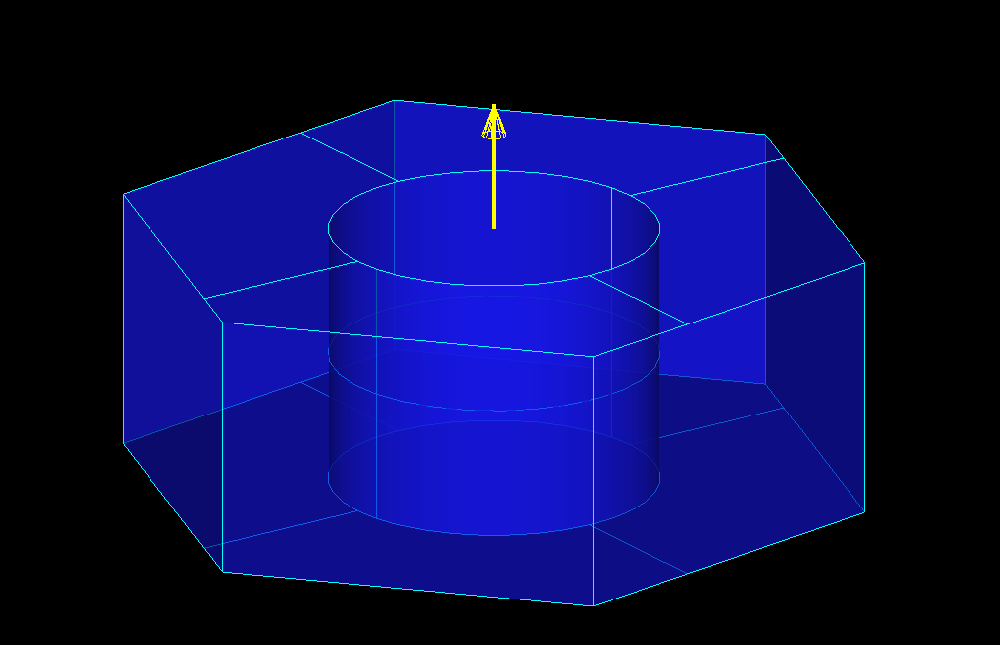

party
*****

.. image:: https://travis-ci.org/osv-team/party.svg?branch=master
    :target: https://travis-ci.org/osv-team/party

.. image:: https://api.codacy.com/project/badge/Grade/8cc4d02e24f84b6c9509046ffa943b38
    :target: https://www.codacy.com/app/guillaume-florent/party?utm_source=github.com&amp;utm_medium=referral&amp;utm_content=osv-team/party&amp;utm_campaign=Badge_Grade

.. image:: https://anaconda.org/gflorent/party/badges/latest_release_date.svg
    :target: https://anaconda.org/gflorent/party

.. image:: https://anaconda.org/gflorent/party/badges/version.svg
    :target: https://anaconda.org/gflorent/party

.. image:: https://anaconda.org/gflorent/party/badges/platforms.svg
    :target: https://anaconda.org/gflorent/party

.. image:: https://anaconda.org/gflorent/party/badges/downloads.svg
    :target: https://anaconda.org/gflorent/party

The full documentation is on `Read the Docs <http://party.readthedocs.io/en/latest/>`_

What is party ?
===============

**party** is a Python package that handles parts libraries creation and use through plain text (JSON) files for open hardware projects.

WARNING : **party** is currently in *work in progress* status

**party** aims at creating and handling parts libraries defined in a single text (JSON) file where the metadata, the data, the
geometry creation logic and the *anchors* creation logic are defined.

The *anchors* concept is a set of vectors attached to a part geometry that can be used to place the part in an assembly.

   ISO 4032 M2.5 Nut from a parts library file (the small yellow arrow represents the anchor)

Installing
==========

The recommended way to install **party** uses Docker and is explained in `INSTALL.rst <./INSTALL.rst>`_

Parts libraries creation
========================

A parts library might contain a lot of duplicated information (e.g. all the M3 screws will have the data defined for their threading).  **party** provides standard mechanisms to avoid this duplication and to create the parts
libraries JSON files from **template** files
where no data is duplicated.

The parts library files must also contain the part geometry creation logic. **party** deals with inserting the geometry creation defined
in a Python script into the parts library JSON file. The geometry creation logic can also define **anchors** that allow to attach
the parts from the library in a wider project.

Parts libraries use
===================

**party** can generate CAD files from the parts library JSON file (PLJSON)
and documentation in several formats for the parts library (HTML, PDF, ePub, Latex..) using Sphinx.

Dependencies
============

**party** depends on:

- `ccad <https://github.com/osv-team/ccad>`_ (which itself depends on `PythonOCC <http://www.pythonocc.org/>`_)

- `jinja2 <http://jinja.pocoo.org/>`_

